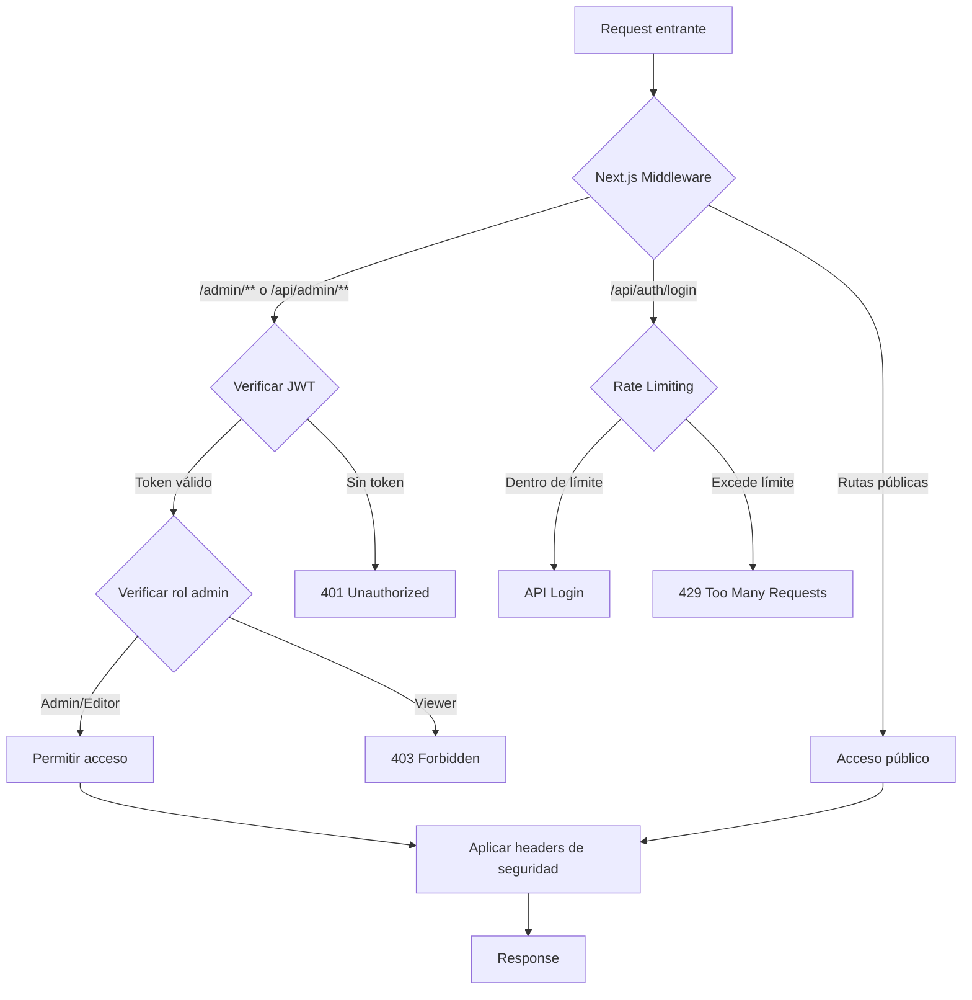

# Fase 2: Seguridad Mínima Viable

## Objetivo
Asegurar que solo usuarios autorizados puedan modificar contenido y proteger la API/admin antes del lanzamiento, manteniendo compatibilidad con Server Components y sin afectar el rendimiento de lectura pública.

## Arquitectura de Seguridad



## Tareas de Implementación

### 1. Middleware Global de Autenticación

**Archivo:** `middleware.ts` (raíz del proyecto)

Proteger todas las rutas `/admin/**` y `/api/admin/**` con verificación JWT y roles.

**Funcionalidades:**
- Verificar token JWT desde cookie `auth-token` o header `Authorization`
- Validar rol mínimo requerido (admin para rutas admin)
- Redirigir a `/admin/login` si no está autenticado
- Retornar 401/403 en APIs si no está autorizado

**Dependencias:**
- Usar `getUserFromRequest` de `lib/auth.ts`
- Usar `hasPermission` para verificar roles

### 2. Protección de Rutas Admin (Server Components)

**Archivos afectados:**
- `app/admin/page.tsx`
- `app/admin/obras/page.tsx`
- `app/admin/autores/page.tsx`
- `app/admin/usuarios/page.tsx`
- `app/admin/configuracion/page.tsx`
- `app/admin/busqueda/page.tsx`
- `app/admin/importar/page.tsx`
- `app/admin/obras/[slug]/editar/page.tsx`
- `app/admin/obras/nueva/page.tsx`

**Implementación:**
- Crear helper `requireAdminAuth()` que verifique autenticación en Server Components
- Redirigir a `/admin/login` si no está autenticado
- Usar `cookies()` de Next.js para leer token

### 3. Protección de API Routes Admin

**Archivos afectados:**
- `app/api/admin/obras/route.ts`
- `app/api/admin/obras/[id]/route.ts`
- `app/api/admin/import/word/route.ts`
- Futuras rutas admin

**Implementación:**
- Crear helper `requireAdminAPI()` para APIs
- Retornar 401/403 JSON si no está autorizado
- El middleware ya protegerá, pero añadir verificación adicional como defensa en profundidad

### 4. Rate Limiting

**Librería:** `@upstash/ratelimit` (gratis, compatible con Vercel) o `rate-limiter-flexible` (alternativa)

**Rutas a proteger:**
- `/api/auth/login` - 5 intentos por IP cada 15 minutos
- `/api/admin/**` - 100 requests por minuto por usuario autenticado
- `/api/search` - 30 requests por minuto por IP (opcional, para prevenir abuso)

**Implementación:**
- Crear `lib/rateLimit.ts` con configuración por ruta
- Integrar en middleware y rutas API específicas
- Usar Redis para producción (Upstash) o memoria para desarrollo

### 5. Headers de Seguridad

**Archivo:** `next.config.js`

**Headers a añadir:**
- `Content-Security-Policy` (CSP) - Política estricta pero compatible con Next.js
- `Strict-Transport-Security` (HSTS) - Solo en producción
- `X-Frame-Options` - Ya existe, mantener
- `X-Content-Type-Options` - Ya existe, mantener
- `Referrer-Policy` - `strict-origin-when-cross-origin`
- `Permissions-Policy` - Deshabilitar features innecesarias

**Consideraciones:**
- CSP debe permitir `'unsafe-inline'` para scripts de Next.js en desarrollo
- En producción, usar nonces o hashes para scripts inline

### 6. Mejoras al Sistema JWT

**Archivo:** `lib/auth.ts`

**Mejoras:**
- Validar que `JWT_SECRET` tenga mínimo 32 caracteres en producción
- Añadir validación de expiración más estricta
- Añadir función `refreshToken()` para renovación segura
- Mejorar manejo de errores

### 7. Hardening de MongoDB Atlas

**Documentación:** Crear `docs/MONGODB_SECURITY.md`

**Recomendaciones para MongoDB Atlas:**
- Usuario de aplicación con privilegios mínimos (solo lectura/escritura en DB específica)
- Network Access: Whitelist de IPs (Vercel IPs + IPs de desarrollo)
- Database Access: Rol `readWrite` solo en base de datos específica
- Habilitar Encryption at Rest
- Habilitar Audit Logging (opcional, para monitoreo)
- Rotación de credenciales cada 90 días
- Deshabilitar usuario admin por defecto
- Usar Connection String con autenticación

**Scripts:**
- Crear script de validación de conexión segura
- Documentar proceso de rotación de credenciales

### 8. Validación y Pruebas

**Pruebas funcionales:**
- Intentar acceder a `/admin` sin autenticación → debe redirigir a login
- Intentar acceder a `/api/admin/obras` sin token → debe retornar 401
- Intentar login con credenciales incorrectas 6 veces → debe bloquear (rate limit)
- Verificar headers de seguridad en respuesta
- Probar acceso con roles viewer/editor → debe denegar acceso admin

**Script de pruebas:** `scripts/test-security.js`

## Orden de Implementación

1. **Middleware de autenticación** (base de todo)
2. **Protección de rutas admin** (Server Components)
3. **Protección de API routes admin**
4. **Rate limiting** (login primero, luego APIs)
5. **Headers de seguridad**
6. **Mejoras JWT**
7. **Documentación MongoDB**
8. **Pruebas y validación**

## Archivos a Crear/Modificar

### Nuevos archivos:
- `middleware.ts` - Middleware global de Next.js
- `lib/rateLimit.ts` - Utilidades de rate limiting
- `lib/auth-helpers.ts` - Helpers para Server Components
- `docs/MONGODB_SECURITY.md` - Guía de hardening MongoDB
- `scripts/test-security.js` - Script de pruebas de seguridad

### Archivos a modificar:
- `next.config.js` - Añadir headers de seguridad completos
- `lib/auth.ts` - Mejoras de validación JWT
- `app/admin/**/*.tsx` - Añadir verificación de autenticación
- `app/api/admin/**/*.ts` - Añadir verificación de autenticación
- `app/api/auth/login/route.ts` - Añadir rate limiting
- `package.json` - Añadir dependencias de rate limiting

## Dependencias Nuevas

```json
{
  "@upstash/ratelimit": "^1.0.0",
  "@upstash/redis": "^1.0.0"
}
```

O alternativamente:
```json
{
  "rate-limiter-flexible": "^5.0.0"
}
```

## Variables de Entorno Nuevas

```env
# Rate Limiting (Upstash)
UPSTASH_REDIS_REST_URL=
UPSTASH_REDIS_REST_TOKEN=

# O para rate limiting en memoria (solo desarrollo)
RATE_LIMIT_ENABLED=true

# JWT (validar que existe y es seguro)
JWT_SECRET=  # Debe tener mínimo 32 caracteres en producción
```

## Riesgos Remanentes (Post-Fase 2)

1. **CSRF Protection** - Next.js App Router tiene protección básica, pero considerar tokens CSRF para formularios críticos
2. **Input Validation** - Añadir validación estricta con Zod o similar
3. **SQL Injection** - No aplica (MongoDB), pero validar queries
4. **XSS** - Next.js escapa por defecto, pero revisar contenido dinámico
5. **Session Management** - Considerar invalidación de sesiones, logout forzado
6. **Audit Logging** - Registrar acciones admin para auditoría
7. **2FA** - Considerar autenticación de dos factores para admins

## Métricas de Éxito

- ✅ Todas las rutas `/admin/**` requieren autenticación
- ✅ Todas las rutas `/api/admin/**` requieren autenticación y rol admin
- ✅ Rate limiting activo en login (máx 5 intentos/15min)
- ✅ Headers de seguridad presentes en todas las respuestas
- ✅ JWT_SECRET validado (mínimo 32 caracteres en producción)
- ✅ Documentación de hardening MongoDB completa
- ✅ Pruebas funcionales pasando

## Notas de Compatibilidad

- **Server Components:** El middleware funciona con RSC sin problemas
- **Rendimiento:** Rate limiting usa Redis (Upstash) que es rápido, impacto mínimo
- **Desarrollo:** Rate limiting puede usar memoria en desarrollo si no hay Redis
- **Vercel:** Upstash es compatible y recomendado para Vercel


